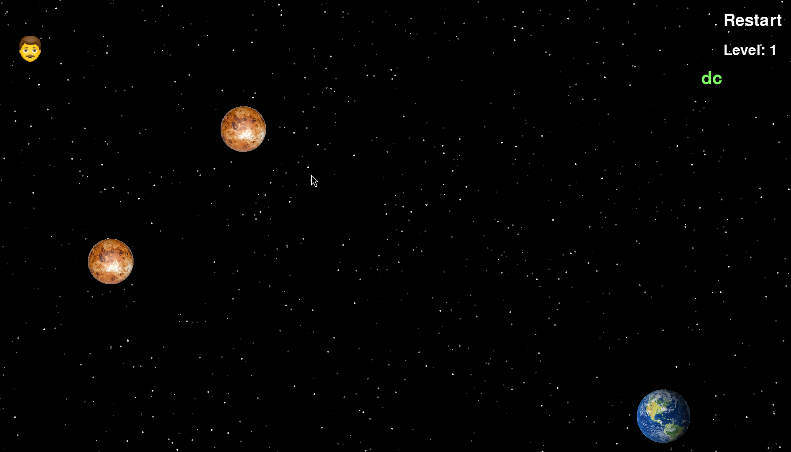
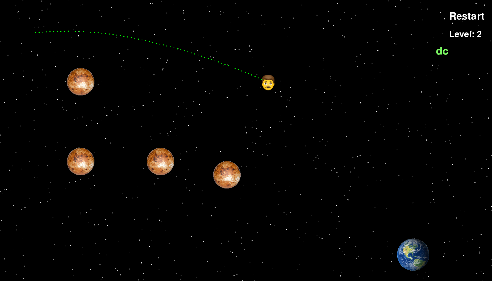
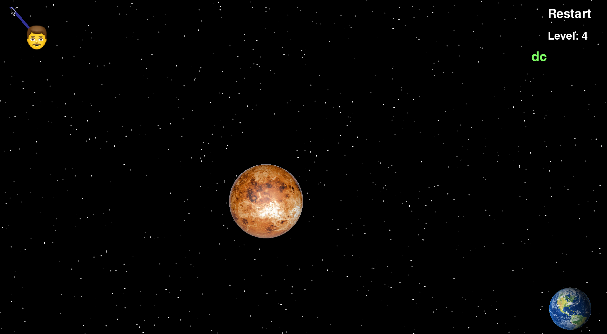

# Slingshotty

Welcome to **Slingshotty** - a captivating space adventure game built with Python and Pygame. Navigate your astronaut through the vastness of space, leveraging gravitational forces to safely reach Earth while avoiding perilous planets.


## Table of Contents
- [About the Game](#about-the-game)
- [Features](#features)
- [Installation](#installation)
- [How to Play](#how-to-play)
- [Screenshots](#screenshots)
- [Contributing](#contributing)
- [License](#license)
- [Acknowledgements](#acknowledgements)

## About the Game

**Slingshotty** is a physics-based game where you control an astronaut's trajectory using a sling mechanism. The game's objective is to guide the astronaut through space, avoiding collisions with planets and using their gravitational pull to navigate towards Earth.

### Key Concepts

- **OOPS and Clean Code**: The game is developed with a focus on Object-Oriented Programming principles and clean, maintainable code.
- **Physics-Based Movement**: The astronaut's movement is influenced by the gravitational forces exerted by nearby planets.

## Features

- **Engaging Gameplay**: Drag and release the astronaut to launch him through space.
- **Realistic Physics**: The astronaut's path is affected by the gravitational pull of planets, adding a layer of strategic planning.
- **Multiple Levels**: Navigate through various levels, each with unique challenges and obstacles.
- **Intuitive Controls**: Simple mouse controls for dragging and launching the astronaut.

## Installation

Follow these steps to set up and play **Slingshotty** on your local machine:

1. **Clone the repository**:
    ```sh
    git clone https://github.com/yourusername/slingshotty.git
    cd slingshotty
    ```

2. **Run the install script (it will automatically run the game after installation)**:
    ```sh
    source install.sh
    ```
3. **To run it after installation**
  ```sh
    source .venv/bin/activate
    python src/main.py
  ```

## How to Play

1. **Objective**: Move the astronaut through space to reach Earth while avoiding other planets.
2. **Controls**:
    - **Mouse**: Click and drag the astronaut to aim. Release to launch.
3. **Gameplay Tips**:
    - Use the gravitational pull of planets to slingshot the astronaut.
    - Plan your trajectory carefully to avoid collisions.

## Screenshots


*Level demo*


*Look at the trajectory of the astronaut.*


*Easy drag and slingshot controls.*

## Contributing

We welcome contributions! If you'd like to contribute to **Slingshotty**, please follow these steps:

1. Fork the repository.
2. Create a new branch (`git checkout -b feature-branch`).
3. Make your changes and commit them (`git commit -m 'Add some feature'`).
4. Push to the branch (`git push origin feature-branch`).
5. Open a Pull Request.

## Acknowledgements

- [Pygame](https://www.pygame.org/) - The game library used for developing **Slingshotty**.
- Inspiration from classic space-themed games.
